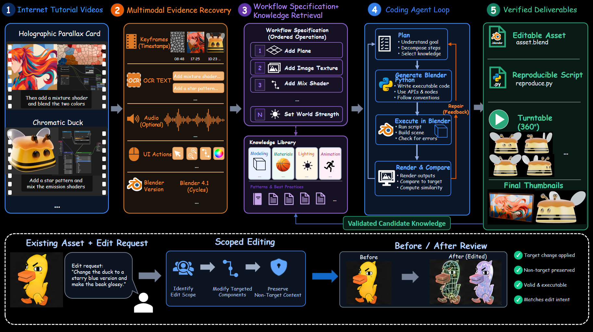

# BlenderLore

<p align="center">
  <strong>Learning 3D Coding from Internet Tutorial Videos</strong>
</p>

<p align="center">
  <a href="https://3d-coding-blender.github.io/">Project Website</a> ·
  <a href="https://github.com/3D-Coding-Blender/3D-Coding-Blender.github.io">GitHub</a>
</p>

<p align="center">
  <a href="https://3d-coding-blender.github.io/"></a>
  <a href="https://github.com/3D-Coding-Blender/3D-Coding-Blender.github.io"></a>
  <a href="https://huggingface.co/"></a>
</p>

> **Status:** research prototype and interactive project page. Paper identifier, dataset release, and pretrained artifacts will be updated when they are available.

## Overview

Blender tutorials contain practical knowledge that is difficult for an AI agent to use directly. Important steps may appear in narration, captions, changing interface states, node graphs, or short modeling operations, while a final render does not explain how the asset was built.

BlenderLore explores an agent pipeline that turns tutorial videos into executable, editable Blender workflows. The system combines multimodal evidence, workflow reconstruction, Blender Python generation, execution, visual validation, and reusable knowledge retention. The website presents the resulting assets and the evidence behind them.

The primary output is an editable `.blend` scene and its reproducible script—not only a flattened image.

## Highlights

1. **Tutorial-to-workflow reconstruction** — recover ordered modeling, material, lighting, and animation operations from real Blender videos.
2. **Multimodal evidence** — combine keyframes, OCR, transcript or audio evidence, timestamps, interface states, and Blender-version cues.
3. **Executable Blender code** — generate and run Python inside Blender, then inspect fresh renders and multi-view evidence.
4. **Closed-loop repair** — compare results against the target and iterate when geometry, materials, lighting, or motion need correction.
5. **Editable deliverables** — retain `.blend` files, scripts, node graphs, renders, turntables, and execution traces as a reusable knowledge library.
6. **Generation and editing workflows** — create assets from tutorials or apply learned techniques to existing assets while preserving non-target content.

## Demonstrations

The live page includes interactive Three.js viewers, workflow diagrams, videos, and material-transfer studies:

- **Generation:** Stained Glass Asuka, Golden Fur Ball, holographic and procedural material studies.
- **Editing:** Chromatic Duck Gigi and a collection of appearance edits.
- **Glass Heart Material Transfer:** the same glass language transferred across multiple forms.
- **Scientific visualization:** compact neuron, cell, and membrane examples.
- **Interactive hero assets:** Holographic Foil Card, Iridescent Duck Gigi, Stained Glass Window, and Golden Fur Ball.

The workflow overview is also available as a standalone image:



## How It Works

1. **Collect tutorials** — select a high-quality Blender tutorial and define the target asset or supported motion.
2. **Recover evidence** — align visual keyframes, OCR, narration, timestamps, interface actions, and version cues.
3. **Specify the workflow** — convert evidence into ordered operations and retrieve relevant procedural knowledge.
4. **Code, run, and repair** — generate Blender Python, execute it, render the scene, compare the result, and repair failures.
5. **Verify and retain** — package editable assets and evidence, then retain validated patterns for future tasks.

## What You Get

- Editable `asset.blend`
- Reproducible `reproduce.py`
- Material and node-graph evidence
- Fresh renders and six-view observations
- Turntable or validated animation when motion is supported
- Execution receipts and reconstruction traces
- Candidate reusable knowledge for future modeling and material tasks

## Repository Layout

```text
.
├── index.html                 # Project homepage
├── base.css                   # Base page styles
├── surflo.css                 # Layout and presentation styles
├── surflo.js                  # Page interactions and viewers
├── assets/
│   ├── models/                # Interactive GLB hero assets
│   ├── showcase/              # Material, modeling, editing, and glass videos
│   ├── workflows/             # Tutorial inputs, node graphs, and scripts
│   ├── images/                # Reconstruction and comparison figures
│   └── method-pipeline.png    # Workflow overview figure
└── README.md
```

## Run Locally

This repository is a static site. No build step is required for the current demo.

```bash
git clone https://github.com/3D-Coding-Blender/3D-Coding-Blender.github.io.git
cd 3D-Coding-Blender.github.io
python3 -m http.server 8080
```

Open <http://localhost:8080> in a modern browser. A local HTTP server is recommended because GLB modules, textures, and media can be restricted when loaded directly from `file://` URLs.

## Project Links

The following destinations are placeholders until the project releases its final publication and data artifacts:

- **Project page:** <https://3d-coding-blender.github.io/>
- **Code:** <https://github.com/3D-Coding-Blender/3D-Coding-Blender.github.io>
- **Dataset:** <https://huggingface.co/>
- **Model and asset release:** <!-- TODO: add the final model or asset URL -->

## Roadmap

- [ ] Finalize paper title, authors, and arXiv identifier
- [ ] Release the reconstructed tutorial dataset and metadata format
- [ ] Publish benchmark tasks and quantitative evaluation results
- [ ] Release reproducible Blender scripts and scene packages
- [ ] Add more tutorial domains, asset categories, and repair diagnostics

## Citation

```bibtex
@misc{blenderlore2026,
  title       = {BlenderLore: Learning 3D Coding from Internet Tutorial Videos},
  author      = {BlenderLore Team},
  year        = {2026},
  publisher   = {GitHub},
  journal     = {GitHub repository},
  howpublished = {\url{https://github.com/3D-Coding-Blender/3D-Coding-Blender.github.io}},
}
```

## Acknowledgements

This project builds on the Blender ecosystem, Three.js, and the open-source tools that make browser-based 3D visualization and reproducible graphics possible. Individual asset and tutorial credits will be added alongside the final dataset and paper release.

## License

The repository license is **to be confirmed**. Please check the repository before reusing code, media, models, or tutorial-derived assets.
